<picture>
  <source media="(prefers-color-scheme: dark)" srcset="metrics/banner-dark.svg">
  
</picture>

I write and package **free software**. Most of my time goes into mainline **Linux** and **postmarketOS** support for Qualcomm phones, Linux distribution tooling, and small, fast system services in **Rust** and **Go**. When something upstream breaks, I send the fix back. Over the years that has meant patches to the Linux kernel, postmarketOS, systemd, LocalAI, ScummVM, DevilutionX and EasyEffects.

### What I work on

| Area | Highlights |
| :--- | :--- |
| **Kernel** | [**Linux mainline**](https://github.com/torvalds/linux/commits?author=M0Rf30): Qualcomm MSM8953/SDM630 device trees, PMI8950 PWM support in `leds-qcom-lpg`, a Novatek touchscreen fix · [**postmarketOS**](https://gitlab.postmarketos.org/M0Rf30): `linux-postmarketos-qcom-msm8953` kernel upgrades, ALSA UCM audio profiles, `lk2nd-msm8953`, and the ports for the Xiaomi Redmi 5 Plus (vince) and Redmi Note 6 Pro (tulip) |
| **Packaging** | [**yap**](https://github.com/M0Rf30/yap): builds deb, rpm and apk packages from PKGBUILD specs · [**PKGBUILD**](https://github.com/M0Rf30/PKGBUILD): the Arch Linux recipes I maintain · [**android-udev-rules**](https://github.com/M0Rf30/android-udev-rules): one of the most comprehensive sets of Android udev rules around |
| **Rust** | [**rmpd**](https://github.com/M0Rf30/rmpd): an MPD server in pure Rust · [**netsukuku-rs**](https://github.com/M0Rf30/netsukuku-rs): a new implementation of the Netsukuku mesh network · [**opensubsonic-rs**](https://github.com/M0Rf30/opensubsonic-rs) · [**lyra**](https://github.com/M0Rf30/lyra) |
| **Identity** | [**opencie**](https://github.com/M0Rf30/opencie): an app for signing and verifying documents with the Italian electronic ID card (CIE) · [**opencie-pkcs11**](https://github.com/M0Rf30/opencie-pkcs11): a cross-platform PKCS#11 library for the CIE |
| **Embedded** | [**simonpi**](https://github.com/M0Rf30/simonpi): runs Raspberry Pi images in QEMU · [**qemu-kernels-rpi**](https://github.com/M0Rf30/qemu-kernels-rpi): the matching QEMU kernel builds |
| **Media** | [**easyeffects-presets**](https://github.com/M0Rf30/easyeffects-presets) · [**stremio-server-go**](https://github.com/M0Rf30/stremio-server-go) · [**shisper**](https://github.com/M0Rf30/shisper): subtitles generated with whisper.cpp |

<picture>
  <source media="(prefers-color-scheme: dark)" srcset="metrics/stats-dark.svg">
  
</picture>

<picture>
  <source media="(prefers-color-scheme: dark)" srcset="metrics/activity-dark.svg">
  
</picture>

<picture>
  <source media="(prefers-color-scheme: dark)" srcset="metrics/languages-dark.svg">
  
</picture>

<picture>
  <source media="(prefers-color-scheme: dark)" srcset="metrics/kernel-dark.svg">
  
</picture>

<picture>
  <source media="(prefers-color-scheme: dark)" srcset="metrics/notable-dark.svg">
  
</picture>

**Recently merged upstream**

<!-- recent-prs:start -->
- [rivulet-kodi/plugin.video.rivulet#56](https://github.com/rivulet-kodi/plugin.video.rivulet/pull/56) — feat/library mode s4me bridge · 2026-09-24
- [zjs81/meshcore-open#558](https://github.com/zjs81/meshcore-open/pull/558) — Save GPX export via file dialog on desktop · 2026-09-21
- [zjs81/meshcore-open#555](https://github.com/zjs81/meshcore-open/pull/555) — Show and copy the full node public key · 2026-09-12
- [Colorado-Mesh/mesh-client#990](https://github.com/Colorado-Mesh/mesh-client/pull/990) — flatpak: keep Electron dist layout (strip-components: 0) · 2026-09-12
- [meshcore-ita/meshcore-ita.github.io#1](https://github.com/meshcore-ita/meshcore-ita.github.io/pull/1) — SEO: sito multipagina, 9 pagine di contenuto, structured data e link di modifica · 2026-09-10
- [rivulet-kodi/plugin.video.rivulet#55](https://github.com/rivulet-kodi/plugin.video.rivulet/pull/55) — ci: publish the newest release tag, not the triggering commit · 2026-08-25
<!-- recent-prs:end -->

<!-- updated:start -->
Cards regenerated daily by <a href=".github/workflows/metrics.yml">a GitHub Actions workflow</a> · last run 2026-09-26
<!-- updated:end -->

